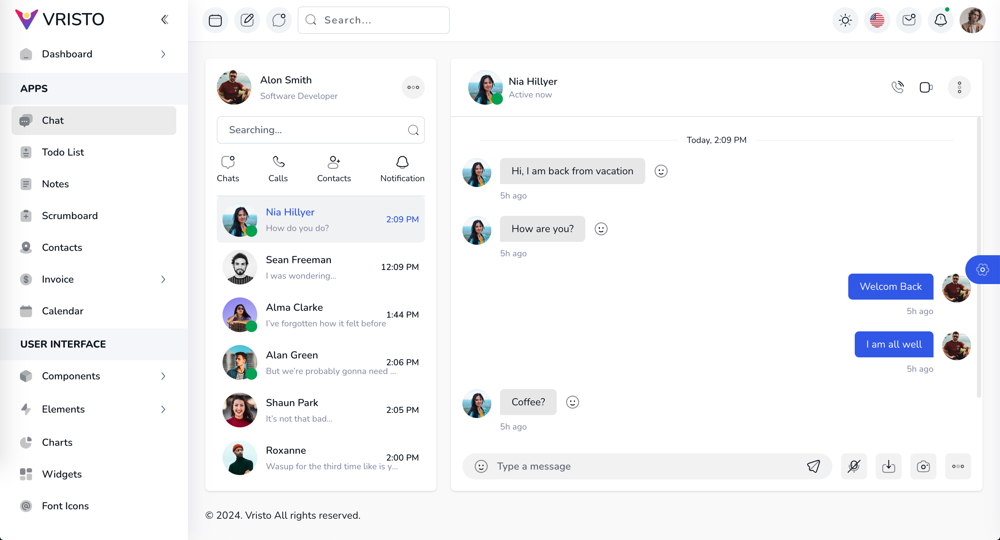

### 1.react-admin-vite

### 2.开发

```bash
# 安装依赖
yarn i

# 启动服务
yarn dev
```

### 3.在线预览
[在线预览](https://minsion.github.io/react-admin-vite)


### 4.项目预览图



### 4、 💕 感谢 Star
小项目获取 star 不易，如果你喜欢这个项目的话，欢迎支持一个 star！

